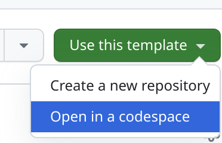
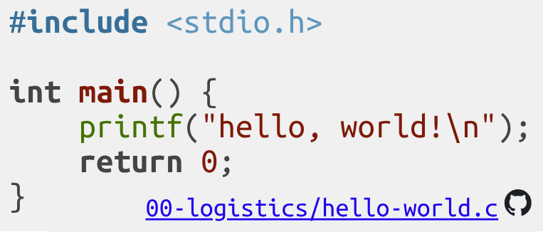

# COMP60261 Part 1: Lecture Code Snippets

This repository contains running examples for all the code snippets presented in the [lecture slides](https://olivierpierre.github.io/comp60261/) of the C part of COMP60261.

To explore and run these code examples directly in your browser you can use GitHubCodespaces.
It is normally a paid feature but you can get access to it for free with a [student](https://education.github.com/pack/?WT.mc_id=academic-81409-leestott) account.

Go to the [repository](https://github.com/olivierpierre/comp60261-devcontainer) page on GitHub, and click on `Use this template` then `Open in a codespace`:

Then simply navigate to the folder of the code snippet you wish to investigate (indicated in the lecture slide at the bottom of the code snippet in question).
For example for the following snippet the file in question is `00-logistics/sample-code.c`:

